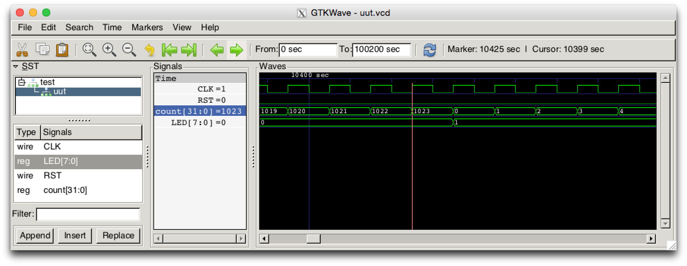

Veriloggen
==============================

[](https://github.com/PyHDI/veriloggen/actions/workflows/main.yml)
[](https://www.travis-ci.com/PyHDI/veriloggen)

A Mixed-Paradigm Hardware Construction Framework

Copyright 2015, Shinya Takamaeda-Yamazaki and Contributors


License
==============================

Apache License 2.0 (http://www.apache.org/licenses/LICENSE-2.0)


Publication
==============================

If you use Veriloggen in your research, please cite my paper about Pyverilog. (Veriloggen is constructed on Pyverilog.)

- Shinya Takamaeda-Yamazaki: Pyverilog: A Python-based Hardware Design Processing Toolkit for Verilog HDL, 11th International Symposium on Applied Reconfigurable Computing (ARC 2015) (Poster), Lecture Notes in Computer Science, Vol.9040/2015, pp.451-460, April 2015.
[Paper](http://link.springer.com/chapter/10.1007/978-3-319-16214-0_42)

```
@inproceedings{Takamaeda:2015:ARC:Pyverilog,
title={Pyverilog: A Python-Based Hardware Design Processing Toolkit for Verilog HDL},
author={Takamaeda-Yamazaki, Shinya},
booktitle={Applied Reconfigurable Computing},
month={Apr},
year={2015},
pages={451-460},
volume={9040},
series={Lecture Notes in Computer Science},
publisher={Springer International Publishing},
doi={10.1007/978-3-319-16214-0_42},
url={http://dx.doi.org/10.1007/978-3-319-16214-0_42},
}
```


What's Veriloggen?
==============================

Veriloggen is a mixed-paradigm framework for constructing a hardware in Python.

Veriloggen provides a low-level abstraction of Verilog HDL AST. You can build up a hardware design written in Verilog HDL very easily by using the AST abstraction and the entire functionality of Python.

In addition to the low-level abstraction of Verilog HDL, Veriloggen provides high-level abstractions to productively express a hardware structure.

- **Stream** is a dataflow-based high-level synthesis layer for high-performance parallel stream processing.
- **Thread** is a procedural high-level synthesis layer to express sequential behaviors, such as DMA transfers and controls.

Veriloggen is not designed for designing a hardware by programmer directly, but is for providing an efficient abstraction to develop a more efficient domain specific language and tools.


Contribute to Veriloggen
==============================

Veriloggen project always welcomes questions, bug reports, feature proposals, and pull requests on [GitHub](https://github.com/PyHDI/veriloggen).

for questions, bug reports, and feature proposals
--------------------

Please leave your comment on the [issue tracker](https://github.com/PyHDI/veriloggen/issues) on GitHub.

for pull requests
--------------------

Please check "CONTRIBUTORS.md" for the contributors who provided pull requests.

Veriloggen uses **pytest** for the integration testing. **When you send a pull request, please include a testing example with pytest.**
To write a testing code, please refer the existing testing examples in "tests" directory.

If the pull request code passes all the tests successfully and has no obvious problem, it will be merged to the *develop* branch by the main committers.


Installation
==============================

Requirements
--------------------

- Python: 3.7.7 or later
    - Python 3.9.5 (via pyenv) is recommended for macOS with Apple Silicon.
- Icarus Verilog: 10.1 or later

```
sudo apt install iverilog
```

- pyverilog: 1.3.0 or later
    - pyverilog requires Jinja2. Jinja2 3.0.3 is recommended for macOS with Apple Silicon.
- numpy: 1.17 or later
    - numpy 1.22.1 is recommended for macOS with Apple Silicon.

```
pip3 install pyverilog numpy
```

Optional installation for testing
--------------------

These are required for automatic testing of **tests** and **examples**.
We recommend to install these testing library to verify experimental features.

- pytest: 3.8.1 or later
- pytest-pythonpath: 0.7.3 or later

```
pip3 install pytest pytest-pythonpath
```

For fast RTL simulation, we recommend to install Verilator.

- Verilator: 4.028 or later

```
sudo apt install verilator
```

Optional installation for visualization
--------------------

To visualize the generated hardware by veriloggen.stream, these libraries are required.

- graphviz: 2.38.0 or later
- pygraphviz: 1.3.1 or later

```
sudo apt install graphviz
pip3 install pygraphviz
```

Install
--------------------

Now you can install Veriloggen using setup.py script:

```
python3 setup.py install
```

Docker
--------------------

Dockerfile is available. You can try Veriloggen on Docker without any installation on your host platform.

```
cd docker
sudo docker build -t user/veriloggen .
sudo docker run --name veriloggen -i -t user/veriloggen /bin/bash
cd veriloggen/examples/led/
make
```


Examples and testing
==============================

There are some exapmles in **examples** and various testing codes in **tests**.
The testing codes are actually good small examples suggesting how to represent a desired function.

To run the testing codes, please type the following commands.

```
cd tests
python3 -m pytest .
```

If you use Verilator instead of Icarus Verilog for RTL simulation, set "--sim" option.

```
python3 -m pytest --sim=verilator .
```


Getting started
==============================

You can find some examples in 'veriloggen/examples/' and 'veriloggen/tests'.

Let's begin veriloggen by an example. Create a example Python script in Python as below. A blinking LED hardware is modeled in Python.
Open 'hello_led.py' in the root directory.

```python
from __future__ import absolute_import
from __future__ import print_function
import sys
import os
from veriloggen import *


def mkLed():
    m = Module('blinkled')
    width = m.Parameter('WIDTH', 8)
    clk = m.Input('CLK')
    rst = m.Input('RST')
    led = m.OutputReg('LED', width, initval=0)
    count = m.Reg('count', 32, initval=0)

    seq = Seq(m, 'seq', clk, rst)

    seq.If(count == 1024 - 1)(
        count(0)
    ).Else(
        count.inc()
    )

    seq.If(count == 1024 - 1)(
        led.inc()
    )

    seq(
        Systask('display', "LED:%d count:%d", led, count)
    )

    return m


def mkTest():
    m = Module('test')

    # target instance
    led = mkLed()

    uut = Submodule(m, led, name='uut')
    clk = uut['CLK']
    rst = uut['RST']

    simulation.setup_waveform(m, uut, m.get_vars())
    simulation.setup_clock(m, clk, hperiod=5)
    init = simulation.setup_reset(m, rst, m.make_reset(), period=100)

    init.add(
        Delay(1000 * 100),
        Systask('finish'),
    )

    return m

if __name__ == '__main__':
    test = mkTest()
    verilog = test.to_verilog(filename='tmp.v')
    #verilog = test.to_verilog()
    print(verilog)

    sim = simulation.Simulator(test)
    rslt = sim.run()
    print(rslt)

    # sim.view_waveform()
```

Run the script.

```
python3 hello_led.py
```

You will have a complete Verilog HDL source code named 'tmp.v' as below, which is generated by the source code generator.

```verilog
module test
(

);

  localparam uut_WIDTH = 8;
  reg uut_CLK;
  reg uut_RST;
  wire [uut_WIDTH-1:0] uut_LED;

  blinkled
  uut
  (
    .CLK(uut_CLK),
    .RST(uut_RST),
    .LED(uut_LED)
  );


  initial begin
    $dumpfile("uut.vcd");
    $dumpvars(0, uut, uut_CLK, uut_RST, uut_LED);
  end


  initial begin
    uut_CLK = 0;
    forever begin
      #5 uut_CLK = !uut_CLK;
    end
  end


  initial begin
    uut_RST = 0;
    #100;
    uut_RST = 1;
    #100;
    uut_RST = 0;
    #100000;
    $finish;
  end


endmodule


module blinkled #
(
  parameter WIDTH = 8
)
(
  input CLK,
  input RST,
  output reg [WIDTH-1:0] LED
);

  reg [32-1:0] count;

  always @(posedge CLK) begin
    if(RST) begin
      count <= 0;
      LED <= 0;
    end else begin
      if(count == 1023) begin
        count <= 0;
      end else begin
        count <= count + 1;
      end
      if(count == 1023) begin
        LED <= LED + 1;
      end 
      $display("LED:%d count:%d", LED, count);
    end
  end


endmodule
```

You will also see the simulation result of the generated Verilog code on Icarus Verilog.

```
VCD info: dumpfile uut.vcd opened for output.
LED:  x count:         x
LED:  x count:         x
LED:  x count:         x
LED:  x count:         x
LED:  x count:         x
LED:  x count:         x
LED:  x count:         x
LED:  x count:         x
LED:  x count:         x
LED:  x count:         x
LED:  0 count:         0
LED:  0 count:         1
LED:  0 count:         2
LED:  0 count:         3
LED:  0 count:         4
...
LED:  9 count:       777
LED:  9 count:       778
LED:  9 count:       779
LED:  9 count:       780
LED:  9 count:       781
LED:  9 count:       782
LED:  9 count:       783
```

If you installed GTKwave and enable 'sim.view_waveform()' in 'hello_led.py', you can see the waveform the simulation result.




Veriloggen extension libraries
==============================

Mixed-paradigm high-level synthesis
--------------------

- veriloggen.thread.Thread: Procedural high-level synthesis for DMA and I/O controls
- veriloggen.thread.Stream: Dataflow-based high-level synthesis for high-performance stream processing

Frequently-used abstractions
--------------------

- veriloggen.verilog: Verilog HDL source code synthesis and import APIs
- veriloggen.simulation: Simulation APIs via Verilog simulators
- veriloggen.seq: Synchronous circuit builder (Seq)
- veriloggen.fsm: Finite state machine builder (FSM)

Please see examples and tests directories for many examples.


Related project
==============================

[Pyverilog](https://github.com/PyHDI/Pyverilog)
- Python-based Hardware Design Processing Toolkit for Verilog HDL

[NNgen](https://github.com/NNgen/nngen)
- A Fully-Customizable Hardware Synthesis Compiler for Deep Neural Network
